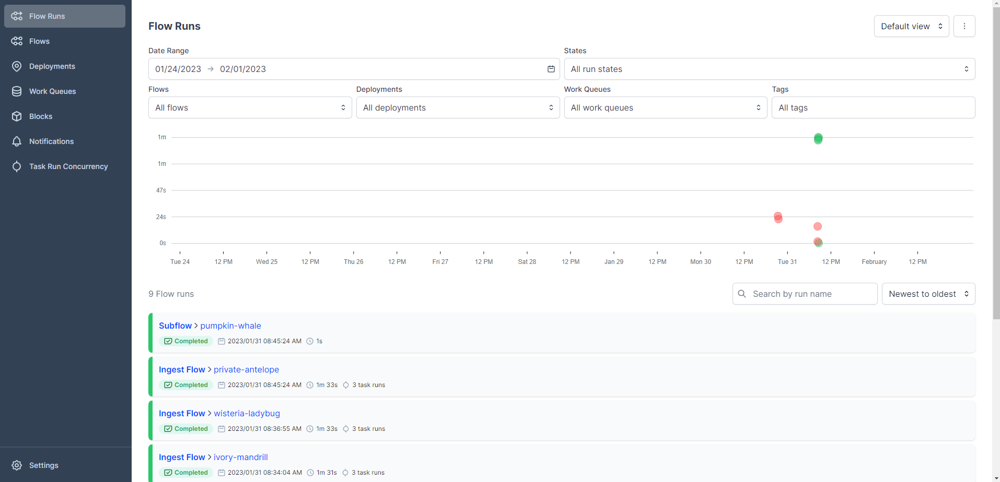

# Workflow Orchestration
1. Run postgre and pdAdmin Docker
2. Run ingest_data.py

```bash
URL="https://github.com/DataTalksClub/nyc-tlc-data/releases/download/yellow/yellow_tripdata_2021-01.csv.gz"

python ingest_data.py \
  --user=root \
  --password=root \
  --host=localhost \
  --port=5432 \
  --db=ny_taxi \
  --table_name=yellow_taxi_trips \
  --url=${URL}
```

# User Interface
```bash
prefect orion start
```
